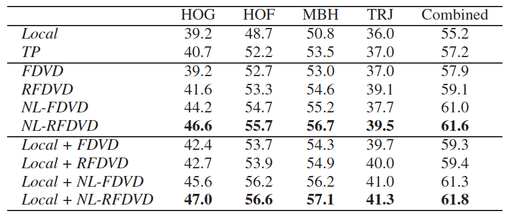

[[pdf](https://www.robots.ox.ac.uk/~vgg/rg/papers/videoDarwin.pdf)][[code](https://bitbucket.org/bfernando/videodarwin)]

## Abstract

本文展示了一种能够捕获视频时序信息的方法。该方法假定能时序性排序视频帧的函数(a function capable of ording the frames of a video)也能非常好的捕获视频中视觉上的演变(evolution of the appearance within the video)。因此本文的重点是，作者通过使用ranking machine学习这样的排序函数并且使用其对应的参数作为一个新的视频表征。并在通用动作识别数据集Hollywood2、HMDB51、细颗粒度的动作MPII-cooking activities和姿势数据集Chalearn中有7%-10%的提升。同时该方法是一种对视频视觉特征的编码，独立于特征提取方法，也就是说视觉特征提取方法越好，编码后对视频动作识别效果也能相应有提升。

## Introduction

在过去十年动作识别的研究主要是在设计时间空间(spatio-temporal)的特征，下面有关的几篇论文：

1. from temporal interest points over dense sampling to dense trajectories.
    1. [On space-time interest points]
    2. [Learning realistic human actions from movies]
    3. [Dense trajectories and motion boundary descriptors for action recognition]
2. from gradient-based descriptors to motion-based and motion-compensated ones.
    1. [Better exploiting motion for better action recognition]
3. adoption of powerful encoding schemes, Fisher Vectors.
    1. [Action recognition with improved trajectories]

提到从视觉上建模时序的演变信息比较困难，研究者们提出了很多方法建模时序信息：HMM，CRF，deep network.

Modeling the video-wide temporal evolution of appearance in videos remains a challenging task, due to the **large variability and complexity of video data**. Actions are performed at **largely varying speeds**. Also the speed of the action often **varies non-linearly** within a single video.

而本文提出一种新的时序信息的建模思路，其本质来源是：

Nevertheless, it is clear that many actions have a characteristic temporal ordering. More precisely, given all the frames
of the video, we learn how to arrange them in chronological order, based on the content of the frames.


## Related work

略...

## Modeling Video-wide temporal evolution (VideoDarwin)

1. Video \\(X = [x_1, x_2, ..., x_n]\\) composed of \\(n\\) frames and frame at \\(t\\) is represented by vector \\(x_t \in R^D\\).
2. Define a vector valued function \\(V\\). The output of the vector valued function \\(v_t\\) is obtained by processing all the frames up to time \\(t\\), \\(x_{1:t}\\). For example, the vector \\(v_t\\) can be obtained by applying the mean operation on all of the frames \\(x_{1:t}\\).
3. Define \\(\Psi(v; u) = u^T \cdot v\\). 
4. Namely, the learning to rank problem optimizes the parameters \\(u\\) of the function \\(\Psi(v; u)\\), such that \\(\forall t_i, t_j , v_{t_i} ≻ v_{t_j} \Leftrightarrow u^T ⋅v_{t_i} > u^T ⋅v_{t_j} \\).

这里的思想是找到一个向量\\(u\\),使得\\(v_i\\)和\\(v_j\\)在该方向上的投影仍然满足时序排序，那么该向量就能表征时序上的演变，也能把许多帧用一个向量表示。论文中给出了向量\\(u\\)的优化求法，据论文所述是使用RankSVM，

$$\mathop{\arg\min}\limits_{u} \frac{1}{2}\left\|u\right\|^2 + C\sum_{\forall i,j v_{t_i} > v_{t_j}} \epsilon_{ij}$$

$$s.t. u^T \cdot (v_{t_i} − v_{t_j} ) \geq 1 − \epsilon_{ij}$$

$$\epsilon_{ij} \geq 0$$

条件1，\\(u^T \cdot (v_{t_i} − v_{t_j} ) \geq 1 − \epsilon_{ij}\\)，即是要满足排序条件大于一个单位量并且有一个松弛因子，如果松弛因子过大会惩罚优化函数。在作者的开源代码(VideoDarwin.m)中作者是通过SVR来解决排序问题(因为SVR比RankSVM要快，并且具有相似的结果)，既给每一帧赋予一个label，比如第一帧的label是1，第二帧是2，依次类推...然后训练一个SVR回归模型求得权重向量u。其实最简单的就是用线性回归进行求解，在论文中也表示这样也是可行的(any other linear learning to rank method can be employed to learn VideoDarwin)。

## Vector valued functions for VideoDarwin

这节主要是提及上面没有解释的向量价值函数V的选取，论文中探寻了3种形式的向量价值函数：

1. Independent Frame Representation. \\(V(t) = \frac{x_t}{\left\|x_t\right\|}\\).
2. Moving Average (MA). \\(\sum_{t}^{t+T} x_t\\).
3. Time Varying Mean Vectors. \\(m_t = \frac{1}{t} \cdot \sum_{i=1}^{t} x_i, v_t = m_t / \left\|m_t\right\|\\).

作者通过实验证明第三种方式效果最好。


## Experiments

### VideoDarwin

VideoDarwin选取的特征：[HOG, HOF, MBH](http://blog.csdn.net/wzmsltw/article/details/52752587) and TRJ. 在实验中作者还提到VideoDarwin几种变型:

1. Forward VideoDarwin (FDVD)，就是将帧按时间\\([x_1,x_2,...,x_n]\\)进行训练得到\\(u_{fow}\\).
2. Reverse & Forward VideoDarwin (RFDVD)，就是既按上面方式得到\\(u_{fow}\\)，然后将帧逆序\\([x_n,x_{n-1},...,x_1]\\)进行训练得到\\(u_{rev}\\).
3. non-linear forward VideoDarwin (NL-FDVD)，就是对特征进行一个非线性映射然后再进行FDVD训练。
4. nonlinear reverse & forward VideoDarwin (NL-RFDVD)，就是对特征进行一个非线性映射然后再进行RFDVD训练。

### 对比的baseline

选择的baseline对比方法是**local** 和 **TP**， For these baselines, at frame level we apply non-linear feature maps (i.e. power normalization for Fisher vectors and chi-squared kernel maps for bag-of-words based methods)：

**local**: As a first baseline we use the state-of-the-art trajectory features (i.e. improved trajectories and dense trajectories) and pipelines as [1,2]. As this trajectory based baseline mainly considers local temporal information we refer to this baseline as **local**. 

**TP**: We also compare with temporal pyramids (**TP**), by first splitting the video into two equal size subvideos, then computing a representation for each of them like spatial pyramids [3].

### 对比结果

对比的结果如下，这里就选了HMDB51数据集的结果展示，剩下的数据集的类似效果，详见论文。



## Conclusion

一种无监督的时序信息建模的方法。

## References

[1] H. Wang, A. Kl¨aser, C. Schmid, and C.-L. Liu. Dense trajectories and motion boundary descriptors for action recognition. IJCV, 103:60–79, 2013. 1, 2, 5, 6, 8

[2] H. Wang and C. Schmid. Action recognition with improved trajectories. In ICCV, 2013. 1, 2, 5, 6, 8

[3] S. Lazebnik, C. Schmid, and J. Ponce. Beyond bags of features: Spatial pyramid matching for recognizing natural scene categories. In CVPR, 2006. 1, 5

## 相关工程和代码

1. http://lear.inrialpes.fr/~wang/improved_trajectories
2. https://lear.inrialpes.fr/people/wang/dense_trajectories


```
asdasd just a test
```
