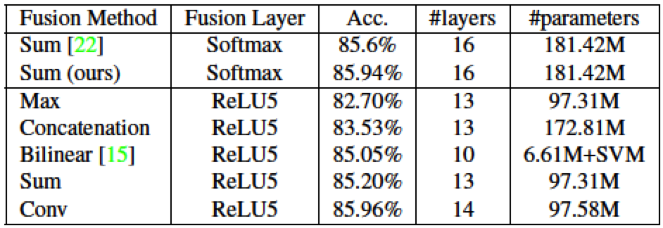
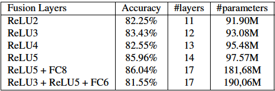

[[pdf](https://arxiv.org/pdf/1604.06573.pdf)][[code](https://github.com/feichtenhofer/twostreamfusion)]

## Abstract

本文主要是研究了很多spatial融合和temporal融合的方法。包括融合的位置和融合的方式，并根据以上结论提出了一个自己的方法。

## Related work

介绍了几篇比较重要的论文，[1]这篇论文介绍了几种temporal sampling方法，包括single frame, early fusion, late fusion和slow fusion。[2]这篇论文验证了temporal pooling效果比较好，也验证了LSTM并没比temporal pooling效果好。另外本文还提及了C3D，two stream，bilinear model。

## Spatial fusion

这节主要研究的是Two-Stream网络结构空间融合的方式。Two-Stream网络是由两个网络构成的，空间网络输入的是一张RGB图像，时序网络输入的是10张光流图片，这里说的是以哪种方式融合空间网络和时序网络。本人觉得Two-Stream可以用如下MXNet伪代码表示，论文中是用VGG-M-2048：

<pre class="highlight"><code>rgb_data = mx.sym.Variable(name='rgb_data') # (1,3,224,224)
rgb_stream = mx.sym.VGGM2048(data=rgb_data) 
rgb_fc = rgb_stream.get_internels()['rgb_fc_output'] # 取出fc分类层 (1,C)
flo_data = mx.sym.Variable(name='flo_data') # (1,10,224,224)
flo_stream = mx.sym.VGGM2048(data=flo_data) 
flo_fc = flo_stream.get_internels()['flo_fc_output'] 取出fc分类层（1,C)
# 这里融合方式是fc层的分类概率融合
# 这篇论文正是讨论如何融合以及融合的位置
net = 0.5 * rgb_fc + 0.5 * flo_fc 
net = mx.sym.softmax(data=net, name='softmax')
</code></pre>

论文中的几种简单的融合方式都用MXNet的伪代码表示:

<pre class="highlight"><code># 获得中间某层输出
rgb = rgb_stream.get_internels()['conv_xxx'] # (1,C,H,W)
flo = flo_stream.get_internels()['conv_xxx'] # (1,C,H,W)
# sum fusion
net = rgb + flo
# max fusion
net = mx.sym.maximum(rgb, flo)
# concat fusion
net = mx.sym.concat(rgb, flo, dim=1)
# conv fusion
net = mx.sym.concat(rgb, flo, dim=1) # (1,2C,H,W)
net = mx.sym.Convolution(data=net, num_filter=C, pad=(0,0), kernel=(1,1), stride=(1,1))
</code></pre>

Bilinear Fusion模型就用公式表示：

$$y^{bil} = \sum_{i=1}^{H} \sum_{j=1}^{W} (x_{i,j}^{a})^T x_{i,j}^b $$

其中\\(x_{i,j}^{a}\\)是一个\\(C\\)维度的向量，\\(x_{i,j}^{b}\\)是一个\\(C\\)维度的向量，\\(y^{bil}\\)是一个\\(C^2\\)维度的向量。

最终作者通过实验有如下结果：

实验结果说明在ReLU5进行Fusion参数数目更少，使用Bilinear、Sum、Conv融合效果较好，其中参数数目少主要是因为两个网络不再各自拥有FC层。

## Where to fuse the networks

该节主要是说融合发生在哪层最好，两个stream融合只要保证feature maps的H和W一样。作者基于Conv融合研究了几个可能的融合处，结果如下：

说明了，融合发生在ReLU5效果最好，是否能得到一个结论融合越晚越好呢？值得思考。作者还发现再在FC8处进行融合效果还会提升，看来融合发生在越后面信息量越好。

## Temporal fusion

感觉本文只讲到了三种时序融合就是3D卷积和3DPooling，另外一种2DPooling只是减少feature maps的空间尺寸，最后只是预测结果概率的平均（类似于Single Frame模型）。

## Proposed architecture

## Implementation details

## Evaluation

## References

[1] Large-scale video classification with convolutional neural networks.

[2] Beyond short snippets: Deep networks for video classification.
